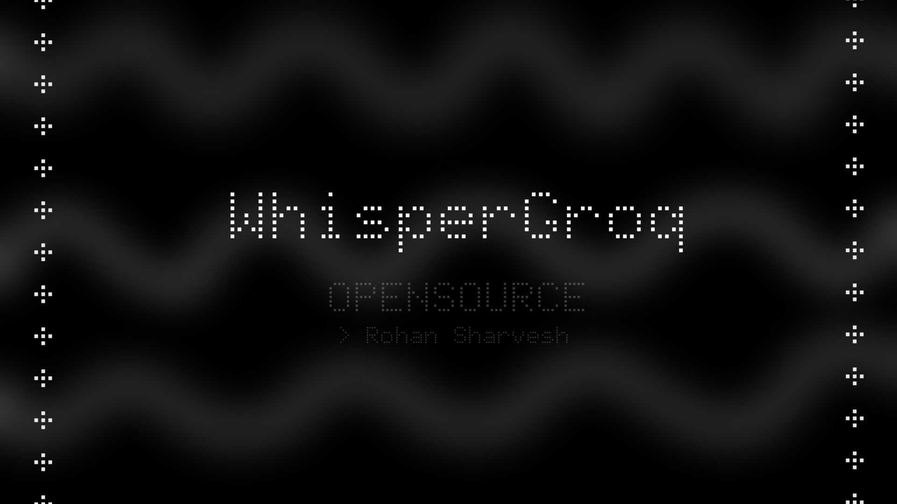

# Whisper Groq



#### Most vibe coders aren’t willin to pay for tools like Whisprflow and frankly, I wasn’t going to pay for something I could get for free with the same precision.
##### I made it pretty simple so anyone can build on top of it without restrictions - like giving it Agentic functions and allowing it to do local tasks. (Integration made easy and free)
##### Groq was offering free and Unlimited API so i had to build somethin with it. ( As of today - 3 Feb 2026 - Groq's offerin free unlimited credits )


This is a small cross-platform tool to press-and-hold a hotkey, record audio, send to Groq's Whisper model, and paste the transcription.

**Project files**: [app.py](app.py), [requirements.txt](requirements.txt), [.env.example](.env.example)

**Quick summary**
- **App model used (Groq)**: `whisper-large-v3-turbo`
- **Required env var**: `GROQ_API_KEY`
- **Hotkey**: configurable via `HOTKEY` (default `f9`)

Getting started (macOS / Linux / Windows)

1) Clone the repo and open a terminal in the project folder.

2) Create and activate a Python virtual environment

macOS / Linux:
```bash
python3 -m venv venv
source venv/bin/activate
```

Windows (PowerShell):
```powershell
python -m venv venv
.\venv\Scripts\Activate.ps1
```

3) Install dependencies
```bash
pip install -r requirements.txt
```

4) Create a `.env` file from `.env.example` and add your GROQ_API_KEY
```bash
cp .env.example .env    # macOS / Linux
# or copy the file in Explorer on Windows, then edit
```
Edit `.env` and set `GROQ_API_KEY` to your Groq API key.

5) Run the app
```bash
python app.py
```
Then press-and-hold the configured hotkey (default `f9`) to record; release to send the audio to Groq and paste the transcription into the focused app.

About Groq API keys
- Visit https://www.groq.com (or the Groq developer console) to sign up and create an API key. Paste the key into your `.env` file as `GROQ_API_KEY`.
- Check the Groq documentation and pricing pages for current free tier or trial availability — policies and pricing can change.

Model and SDK
- This app uses the Groq SDK package (`groq`) and requests the `whisper-large-v3-turbo` model (see `transcribe_with_groq` in `app.py`).

Notes and troubleshooting
- If `sounddevice` fails to open your audio input: try selecting the correct input device or run with elevated permissions. See `sounddevice` docs.
- On some systems the GUI popup transparency may not be supported — this is optional and won't break the core functionality.
- If the `groq` package fails to import, ensure dependencies are installed and that your Python version is supported.

Contributing
- See `DEVELOPERS.md` for developer instructions, extension points, and ways to add tools/agents.

License
- This project is released under the MIT license (see `LICENSE`).

Questions / FAQ
- Q: Where is the transcription stored?
- A: Audio files are written to a temporary file and removed after processing. Transcription text is copied to clipboard and pasted into the active window.


